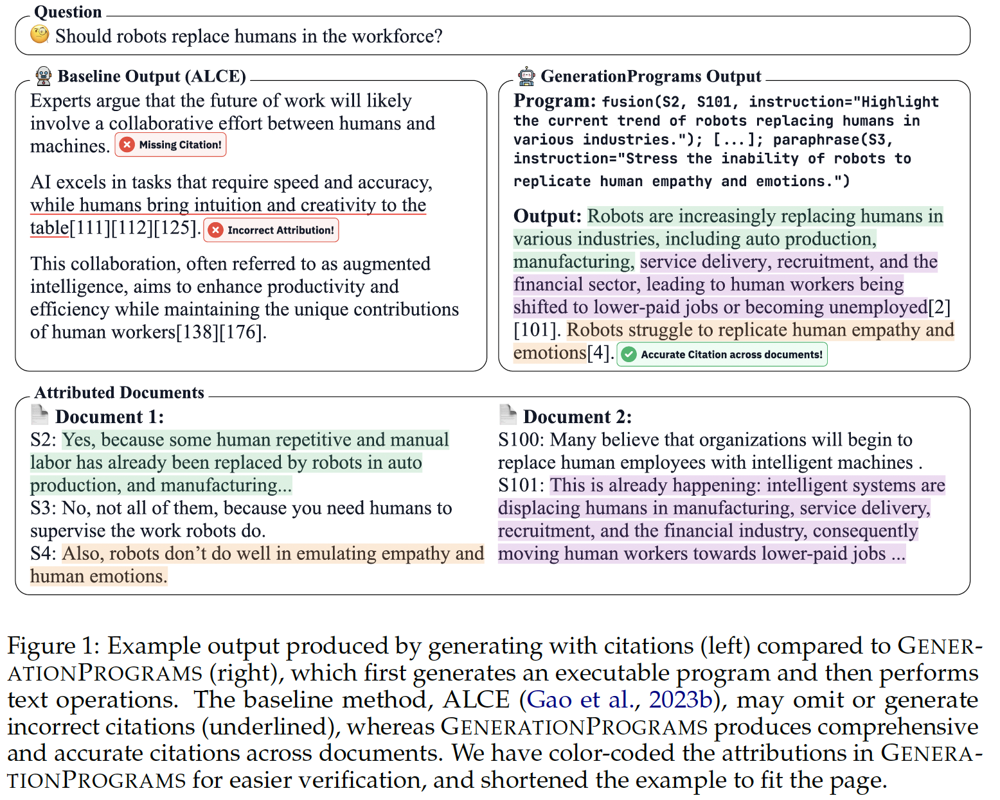

# GenerationPrograms: Fine-grained Attribution with Executable Programs
by [David Wan](https://meetdavidwan.github.io/), [Eran Hirsch](https://eranhirs.github.io/), [Elias Stengel-Eskin](https://esteng.github.io/), [Ido Dagan](https://u.cs.biu.ac.il/~dagani/), [Mohit Bansal](https://www.cs.unc.edu/~mbansal/)



This repo contains the code for our paper [GenerationPrograms: Fine-grained Attribution with Executable Programs](https://arxiv.org/abs/2506.14580).

## Data

Please refer to the respective repository for instructions on downloading the data. We expect a `json` file with the following keys:
- `context`: List[str], where each string is a document
- `question`: str

## Code

The code is located in the `src` directory.

The files are:
1. `program.py`: Contains the `Program` object, which constructs the tree and keeps a record of module inputs and outputs.
2. `run.py`: Script to run the baseline ALCE method.
3. `run_program.py`: Script to run GenerationPrograms.
4. `util.py`: Utilities for parsing and splitting sentences.
5. `model.py`: Model wrapper. It creates a `Model()` object, and running the `run(prompt)` method will execute the model.

Both inference scripts take the same arguments. Here is an example of how to run the code:
```bash
dataset="lfqa"
python src/run.py --data data/${dataset}.json --model gpt4o \
    --prompt prompts/${dataset}_fewshot.txt --fewshot_examples prompts/${dataset}_fewshots_doc.json \
    --output output/gpt4o_${dataset}_alce.json

python src/run_program.py --model gpt4o --add_citation \
    --data data/${dataset}.json  \
    --prompt prompts/program_fewshot.txt  --fewshot_examples prompts/${dataset}_fewshots_program.json \
    --output output/gpt4o_${dataset}_program.json
```

## Citation

If you find our project useful in your research, please cite the following paper:

```bibtex
@misc{wan2025generationprogramsfinegrainedattributionexecutable,
      title={GenerationPrograms: Fine-grained Attribution with Executable Programs}, 
      author={David Wan and Eran Hirsch and Elias Stengel-Eskin and Ido Dagan and Mohit Bansal},
      year={2025},
      eprint={2506.14580},
      archivePrefix={arXiv},
      primaryClass={cs.CL},
      url={https://arxiv.org/abs/2506.14580}, 
}
```